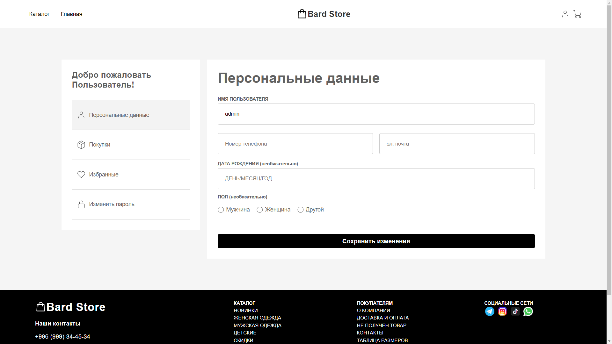
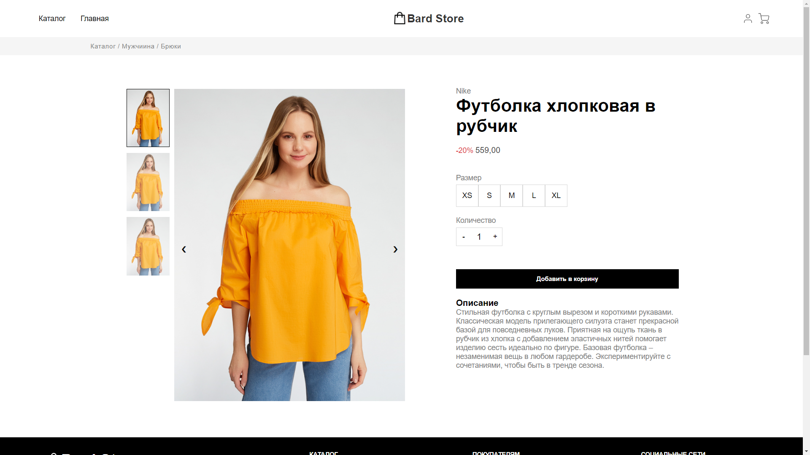
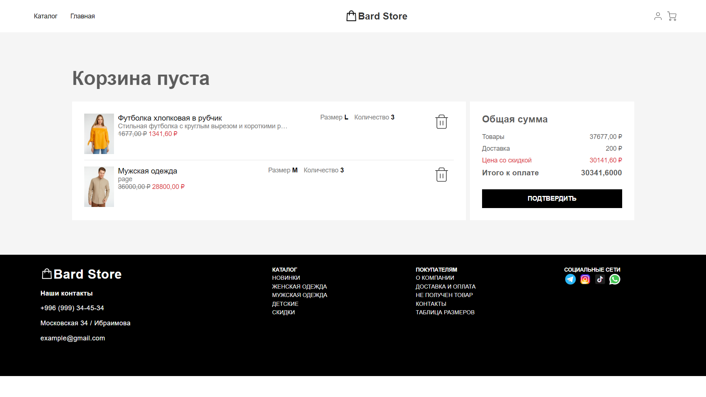

# ecommerce-store-no-adaptive

## Небольшой комерческий сайт для портфолио


## Функциональность

Интернет-магазин обладает следующей функциональностью:

1. **Регистрация и вход**: Пользователи могут зарегистрироваться, создав аккаунт, и войти в систему, используя свои учетные данные.

2. **Добавление товара**: Зарегистрированные пользователи имеют возможность добавлять новые товары в магазин, указывая информацию о названии, описании, цене и других характеристиках товара.

3. **Удаление товара**: Пользователи, обладающие правами администратора, могут удалять товары из каталога.

4. **Сортировка**: Возможность сортировки товаров по категориям.

5. **Поиск**: Также имеется поисковик товаров который облегчает поиск и выбор желаемого товара.

6. **Подсчет товара с учетом скидки**: Система автоматически рассчитывает сумму покупки с учетом скидки, если такая имеется.

7. **Пагинация**: Если количество товаров в магазине значительно, я использую пагинацию для разделения их на страницы, облегчая навигацию по каталогу.

8. **Профиль пользователя**: Каждый зарегистрированный пользователь имеет свой профиль, где можно просматривать информацию о нем и его предыдущих покупках.

9. **Изменение профиля**: Пользователи могут обновлять свои данные в профиле.

10. **Добавление в корзину**: Пользователи могут добавлять товары в корзину перед оформлением покупки.

11. **Удаление из корзины**: Пользователи могут удалять товары из корзины, если они передумали покупать или хотят добавить другие товары.

12. **Подсчет общей суммы товаров в корзине**: Корзина автоматически подсчитывает общую сумму всех товаров, добавленных туда пользователем.

## Технологии

В проекте используются следующие технологии:

- **Backend**: Я использую Django фреймфорк для реализации серверной логики и взаимодействия с базой данных.

- **Frontend**: Фронтенд разработан с использованием HTML, CSS, JS предоставляющие удобный пользовательский интерфейс для взаимодействия с сервером.

- **База данных**: Для хранения данных о товарах, пользователях и корзине используется стандартная БД в Django - Sqlite3. При желании его можно сменить.

## Установка и запуск

Чтобы развернуть проект локально, выполните следующие шаги:

1. Клонируйте репозиторий с GitHub:

```bash
  git clone https://github.com/iusp0/ecommerce-store-no-adaptive.git
```

2. Создайте виртуальное окружение и активируйте его:

```bash
  python -m venv venv
  venv\Scripts\activate.bat
```

3. Перейдите в каталог проекта:

```bash
  cd store
```

4. Установите зависимости для бэкенда:

```bash
  pip install django pillow
```

5. Запустите сервер:

```bash
  python manage.py runserver
```
 Стандартный порт 8000. По желанию можно указать порт сервера следуйщим образом:
```bash
  python manage.py runserver 3000
```
6. Откройте веб-браузер и перейдите по адресу `http://localhost:3000`, чтобы взаимодействовать с интернет-магазином.

## Демо

1. Главное меню


2. Каталог


3. Профиль

В поле ввода номера телефона стоит маска для ввода номера телефона
Я спользовал плагин JS: **maskedinput**.
Документацию по его установке можете найти [Здесь](https://webstool.ru/jquery.maskedinput.html)



4. Страница Продукта



5. Корзина


